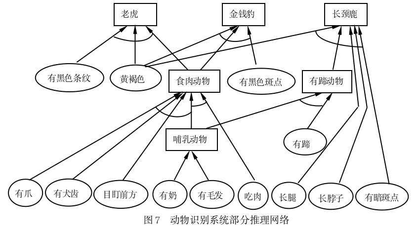
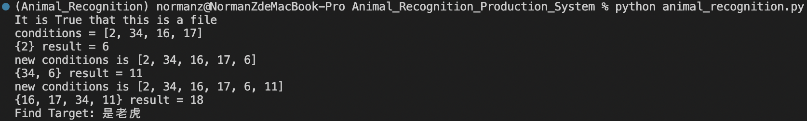
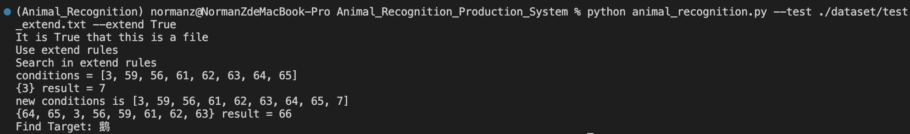

# Animal_Recognition_Production_System

### Recognize animal species by description based on Dynamic rules and database.



This project originates from [the repository where I restore my homework for Intelligent System](https://github.com/DuNGEOnmassster/Intelligent_System_homework.git) as an independent project.

## Setup

#### You are recommended to create a virtual environment with conda

```shell script
conda create -n Animal_Recognition python=3.10

conda activate Animal_Recognition
```

##### For now you don't need to download python packages with Pypi/Conda

## Run

#### Run animal recognition with

```shell script
python animal_recognition.py --test <test_script_file> --extend <True_or_False> --extend_rules <extend_rules_script_file>
```

#### Of course you can just simply start and adjust parameters in [code](./animal_recognition.py)

```shell script
python animal_recognition.py
```

And here are examples for what it would look like if you run `animal_recognition.py` in terminal with test script in [dataset](./dataset/)

without extend          |  with extend
:-------------------------:|:-------------------------:
  |  

Hopefully you will like it.


