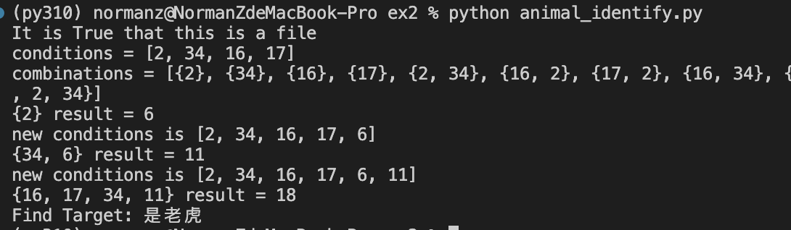
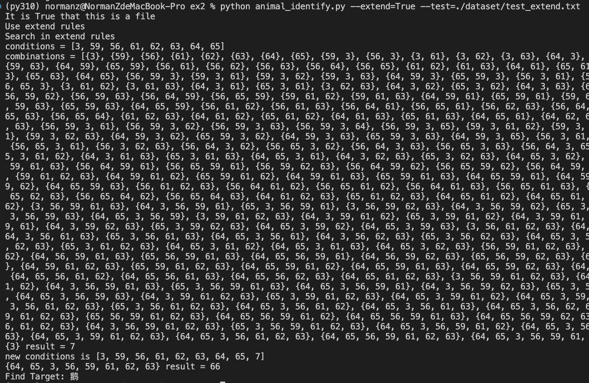

三 实验内容

以动物识别系统为例，用选定的编程语言建造规则库和综合数据库，并能对它们进行增加、删除和修改操作，开发能进行正确的正向推理或反向推理的推理机。

结果demo

详细说明：

 1 动物分类规则集（Ⅰ）
 
      （1）若某动物有奶，则它是哺乳动物。
      
      （2）若某动物有毛发，则它是哺乳动物。
      
      （3）若某动物有羽毛，则它是鸟。
      
      （4）若某动物会飞且生蛋，则它是鸟。
      
      （5）若某动物是哺乳动物且有爪且有犬齿且目盯前方，则它是食肉动物。
      
      （6）若某动物是哺乳动物且吃肉，则它是食肉动物。
      
      （7）若某动物是哺乳动物且有蹄，则它是有蹄动物。
      
      （8）若某动物是有蹄动物且反刍食物，则它是偶蹄动物。
      
      （9）若某动物是食肉动物且黄褐色且有黑色条纹，则它是老虎。
      
      （10）若某动物是食肉动物且黄褐色且有黑色斑点，则它是金钱豹。
      
      （11）若某动物是有蹄动物且长腿且长脖子且黄褐色且有暗斑点，则它是长颈鹿。
      
      （12）若某动物是有蹄动物且白色且有黑色条纹，则它是斑马。
      
      （13）若某动物是鸟且不会飞且长腿且长脖子且黑白色，则它是驼鸟。
      
      （14）若某动物是鸟且不会飞且会游泳且黑白色，则它是企鹅。
      
      （15）若某动物是鸟且善飞且不怕风浪，则它是海燕。
      
2 问题描述

 由上述动物识别规则组成规则库，推理机分别采用正向推理算法或反向推理算法，实现
 
对动物的查询。

如给出初始事实：

F1：某动物有毛发

F2：吃肉

F3：黄褐色

F4：有黑色条纹

目标条件为：该动物是什么？

已完成在[V1提交](https://github.com/DuNGEOnmassster/Intelligent_System_homework/commit/0e84b970e44d75ac634c6f941071381645689127)

demo：

2 在上述规则集(Ⅰ)基础上增加以下规则集(Ⅱ)：

（1）兔子：有毛发，有奶，善跳跃，唇裂；

（2）猫：有毛发，有奶，善捕鼠，脚有肉垫；

（3）犀牛：有毛发，有奶，鼻子上有角，褐色，皮糙肉后，皮糙肉厚，有蹄；

（4）熊猫：有毛发，有奶，黑眼圈，四肢短小；

（5）鹦鹉：鸟类，上嘴鹰钩，会模仿人说话；

（6）鸭子：鸟类，腿短，嘴扁平，善潜水游泳；

（7）鹰：鸟类，上嘴鹰钩，有爪，吃肉；

（8）鸭子：有羽毛，卵生，善游泳，嘴扁平，腿短；

（9）鹅：有羽毛，卵生，善潜水游泳，白色或黑色，颈长，嘴大，腿长，颈部有肉只凸起；

（10）鸦：有羽毛，卵生，黑色，嘴大；

（11）鹰：有羽毛，卵生，有爪，吃肉，上嘴鹰钩；

（12）鹦鹉：有羽毛，卵生，上嘴鹰钩，能模仿人说话；

（13）青蛙：卵生，生活在水中，生活在陆地，有皮肤呼吸，用肺呼吸，皮肤光滑，吃昆虫，会变色；

（14）蝾螈：卵生，生活在水中，生活在陆地，有皮肤呼吸，用肺呼吸，吃昆虫，皮肤粗糙，四肢扁，背部黑色；

（15）蟾蜍：卵生，生活在水中，生活在陆地，有皮肤呼吸，用肺呼吸，吃昆虫，皮肤粗糙；

（16）比目鱼：用鳃呼吸，身体有鳍，生活在海洋中，身体扁平，两眼在头部同侧；

（17）鲫鱼：用鳃呼吸，身体有鳍，生活在淡水中，身体扁平，头高尾部窄；

（18）蛇：生活在陆地，用肺呼吸，胎生，身体有鳞或甲，身体圆而细长，吃小动物；

（19）壁虎：生活在陆地，用肺呼吸，胎生，身体有鳞或甲，有四肢，尾巴细长易断，吃昆虫；

（20）乌龟：生活在陆地，用肺呼吸，胎生，身体有鳞或甲，身体圆而扁，有坚硬的壳；

（21）玳瑁：生活在陆地，用肺呼吸，胎生，身体有鳞或甲，壳为黄褐色，皮肤光滑，有黑斑；

（22）鳄鱼：生活在陆地，用肺呼吸，胎生，身体有鳞或甲，有四肢，善游泳，皮硬黑褐色。

demo：

完成在[V2提交](https://github.com/DuNGEOnmassster/Intelligent_System_homework/commit/34511e8f87861b4301b5dc84ded6ed64d1ba0713)