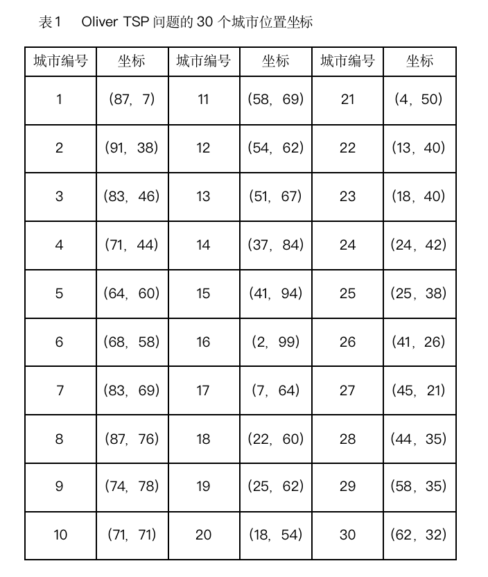
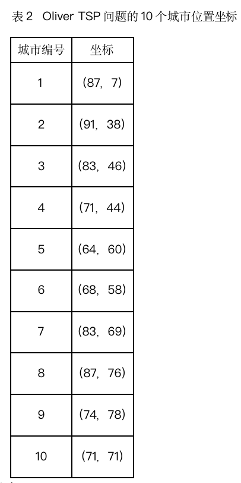

# Experiment 3
## GA in TPS

以N个节点的TSP（旅行商问题）问题为例，应用遗传算法进行求解，求出问题的最优解。

1 旅行商问题

    旅行商问题（Traveling Salesman Problem, TSP），又译为旅行推销员问题、货担郎问题，简称为TSP问题，是最基本的路线问题。假设有n个可直达的城市，一销售商从其中的某一城市出发，不重复地走完其余n-1个城市并回到原出发点，在所有可能的路径中求出路径长度最短的一条。

TSP问题是组合数学中一个古老而又困难的问题，也是一个典型的组合优化问题，现已归入NP完备问题类。NP问题用穷举法不能在有效时间内求解，所以只能使用启发式搜索。遗传算法是求解此类问题比较实用、有效的方法之一。

下面给出30个城市的位置信息：

  最优路径为：1 2 3 4 6 5 7 8 9 10 11 12 13 14 15 16 17 19 18 20 21 22 23 24 25 28 26 27 29 30
  其路径长度为：424.869292
  也可取前10个城市的坐标（如表2）进行测试：

  

  有人求得的最优路径为： 0 3 5 4 9 8 7 6 2 1 0

路径长度是166.541336

上述10个城市的求解中编号从0开始，把所有路径搜索完又返回到出发节点。

2 问题描述

 应用遗传算法求解30/10个节点的TSP（旅行商问题）问题，求问题的最优解。
 